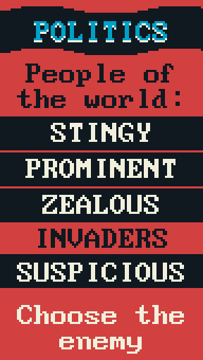
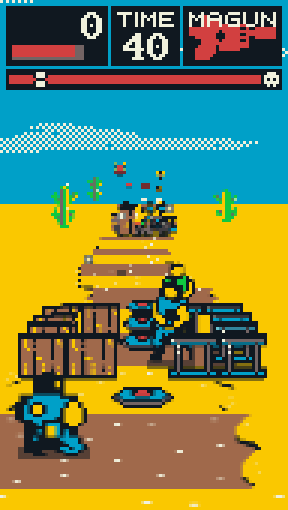
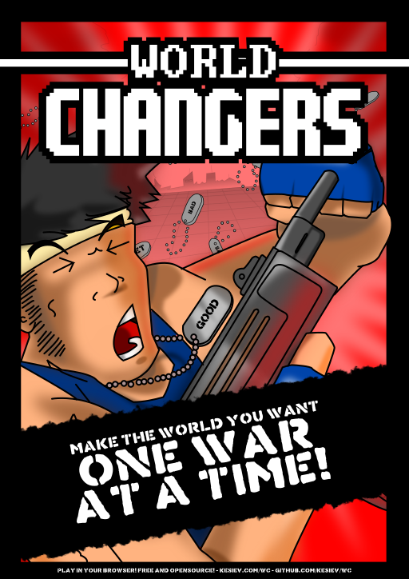

    

## Story

The world is not *right* and that's not good! Try to change it as it should be using the most effective tools humanity invented - according to *the best people* in the history!

First choose your enemy carefully with an accurate, straightforward and comprehensible simulation of the *true* politics, the one you know better...

    

And then... it's war!

    

Defeat your enemies with your skills and firepower... and change the world *one war at a time*!

## The game

**World Changers** is an action game inspired by old classics, like Cabal, Contra and OutRun, and modern games like Gears Of War and mobile casual gaming. You've to choose an enemy and win a war against them eliminating the required amount of enemies within the time limit and without running away from the battlefield. It can be played on desktop using the mouse only or on mobile devices with portrait layout and a single finger.

It supports offline too, so you can add it to your home screen/applications and use it like any other application. It has been tested on Chrome and Firefox on Android and multiple desktop OSs. It's still playable on iOS but it's muted, probably due to a bug of iOS 11.

Play the game [here](https://kesiev.com/wc). It features an in-game manual you can read whenever you want that explains game rules and controls - just select it from the main menu.

Want to share your thoughts? Find me on [Twitter](https://twitter.com/KesieV)!

## The concept

    

A worryingly rising number of people around the world have a sketchy idea of how large scale decisions, compromises, conflicts and consequences works. I'm surely not a political scientist but, as a humble gamer and developer, I decided to wrap these worries and thoughts around few gameplay mechanics in order to explain and share them in a better way. Hope you'll enjoy it!

## The sources

I've used [Gimp](https://www.gimp.org/) for the graphics, [Audacity](https://www.audacityteam.org/) for manipulating audio samples and [Tiled](https://www.mapeditor.org/) for creating stage parts. The game has been written in vanilla JavaScript from scratch and I'm leaving its sources here as I usually do.

## Ideas

I'm leaving here some gameplay ideas I've left out. Maybe, one day...

  * PLAYER: Rolling
  * PLAYER: Classes (i.e. default starting weapon)
  * MECHANIC: Poison/Burn
  * RNG: Increasing card cost during stage generation
  * RNG: Improve foes aim
  * RNG: Stage intensity
  * RNG: Enemy base invulnerability
  * ENEMIES: Boss as normal enemies
  * ENEMIES: Rocket launcher for enemies too
  * ENEMIES: Couch/rolling
  * ENEMIES: Self-healing
  * BOSS: firing with different ray types destroying different covers
  * BOSS: multiple bosses at the same time
  * STAGE: More stage parts
  * STAGE: Blinking laser fences
  * GAME: "New game+"" with increased intensity
  * GAME: "Inferno mode" with maxed intensity
